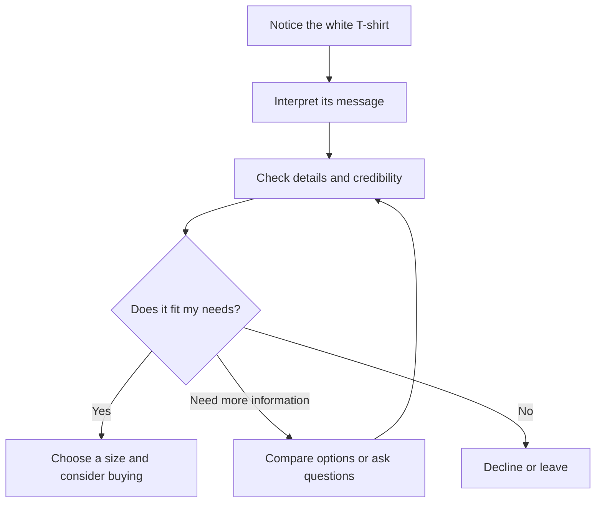

# Chapter 1: Persuasion and Human Decision-Making

Imagine a plain white T-shirt. No logo, no pattern, no special story. Now imagine seeing it in three places: an everyday clothing catalog, a carefully styled fashion photograph, and a campus club's event announcement. The shirt stays the same. What you notice, what it means to you, and whether you want it may change.

That is where persuasion meets branding and design. A brand helps attach meaning to an offer; design makes parts of that meaning visible through words, images, layout, and interaction.

All T-shirt scenarios and sample advertising copy in this chapter are hypothetical teaching examples, not claims about actual products or studies.

## What Persuasion Does

**Persuasion is an attempt to influence what someone thinks, feels, or chooses through communication.** It can offer reasons, evoke emotions, or make information easier to notice. It does not guarantee agreement.

For a designer, four useful questions are:

- **Attention:** What will someone notice? A large photograph might draw attention to the shirt's shape before its price.
- **Interpretation:** What will they think it means? Styling the shirt with a simple outfit might suggest an uncomplicated wardrobe.
- **Trust:** What makes the message believable? Accurate measurements and clear return terms give someone information they can check.
- **Action:** What can they do next? A readable size guide can help them compare options, buy, or decide the shirt is unsuitable.

These are connected tasks, not a guaranteed sequence. Someone may check the price first, return to the photographs, or leave without buying. Ethical success can include helping someone recognize that an offer does not meet their needs.

This diagram is a simplified decision journey. A useful design supports every branch, including the exit.

## Persuasion, Manipulation, and Coercion

These concepts can overlap, but the distinctions help us evaluate a design:

- **Persuasion** tries to influence judgment. An ethical version supplies honest reasons and leaves room to disagree: show the shirt's measurements and explain how to compare them with a shirt you own.
- **Manipulation** steers a decision by misleading people, hiding relevant information, or exploiting vulnerabilities. A countdown that resets whenever the page reloads creates a false reason to hurry.
- **Coercion** uses force or credible threats to compel behavior. A supervisor threatening to cut an employee's shifts unless they buy the shirt would be using coercion.

Emotion alone does not make a message manipulative. A photograph of friends can honestly communicate the pleasure of spending time together. The ethical concern grows when the message deceives, exploits insecurity, or makes refusal costly. A technically available “no” is not enough if the interface hides it or the message threatens consequences.

## Cialdini's Principles of Influence

Psychologist Robert Cialdini's framework originally identified six major principles; he later added **unity**. The mechanisms below summarize his framework. They describe tendencies, not buttons that control everyone.

The applications and misuse examples are hypothetical design choices for our T-shirt.

| Principle | Mechanism | Ethical use | Misuse risk |
| --- | --- | --- | --- |
| Reciprocity | Receiving something can create a desire to give back. | Offer a useful clothing-care guide with no purchase obligation. | Imply that accepting free advice creates a debt to buy. |
| Commitment and consistency | People often want choices to align with earlier voluntary commitments. | Let shoppers who chose a simpler wardrobe goal save basic items for consideration. | Treat a saved shirt as a promise to purchase. |
| Social proof | Especially under uncertainty, people look to others' behavior for guidance. | Display authentic buyer reviews, including fit problems. | Invent reviews or conceal negative feedback. |
| Authority | Relevant expertise can make advice more persuasive. | Include a qualified textile specialist's actual assessment, if available. | Present a celebrity's fame as proof of fabric quality. |
| Liking | People are often more receptive to people they like. | Use a friendly presenter who explains the shirt accurately. | Fake personal friendship to pressure a sale. |
| Scarcity | Limited availability can increase perceived desirability or urgency. | Report a real stock limit for the selected size. | Invent shortages or deadlines. |
| Unity | A sense of shared identity can strengthen influence. | A real campus club can invite members to wear white shirts together. | Suggest that students who decline are disloyal or do not belong. |

Notice the difference between social proof and unity. Social proof involves looking at what others do; unity involves identifying with a shared group. Liking can mean enjoying a presenter's personality without feeling that you belong to the same community.

A principle does not establish product quality. Popularity cannot prove durability, and a stock shortage cannot prove that a shirt is worth its price. Pair persuasive cues with information that helps someone evaluate the actual offer.

## Beyond Cialdini: Two More Useful Ideas

### 1. Framing: What Kind of Choice Is This?

**Framing** means presenting information in a way that emphasizes a particular interpretation. Amos Tversky and Daniel Kahneman demonstrated that different descriptions of the same decision problem can shift preferences. Their work concerns decision framing; the branding examples below apply the broader idea of selective emphasis rather than reproduce their experiments.

Hold the shirt, price, and purchase terms constant. Change only the presentation:

| Frame | Sample copy | Design choice | Meaning emphasized |
| --- | --- | --- | --- |
| Everyday usefulness | “Start with a simple basic.” | Show the shirt in several everyday outfits. | Practical versatility |
| Personal style | “Make simplicity your signature.” | Use restrained typography and a carefully composed outfit photograph. | Deliberate self-expression |
| Shared identity | “Wear white for our club gathering.” | Show an actual club invitation with clear event details. | Participation and belonging |

The physical product has not improved. Each presentation invites a different answer to “Why would I want this?” Someone seeking an ordinary basic may find the first frame useful and the second unconvincing.

Framing becomes misleading when it implies unsupported facts. Minimal packaging does not establish environmental responsibility. A fashion photograph does not establish better stitching. If you claim the shirt is organic, ethically produced, or unusually durable, you need evidence beyond the design.

### 2. Elaboration Likelihood: How Much Thought Goes Into the Message?

Richard Petty and John Cacioppo's **elaboration likelihood model** explains persuasion in terms of how much people think through a message. At greater elaboration, the **central route** involves examining relevant arguments. At lower elaboration, the **peripheral route** relies more on cues or simple associations. Motivation and ability to consider the message matter; these are not fixed types of people.

Imagine shopping for the white T-shirt. When fit matters and you have time, you might study measurements, fabric information, and returns. While scrolling quickly, you might respond mainly to an appealing presenter or photograph. The same person can approach the same product differently in different situations.

For design, this suggests two responsibilities: make the main message easy to understand, and keep supporting details easy to find. Use an inviting photograph alongside readable specifications. Do not bury material information because a visitor might be in a hurry. Attractive presentation can invite attention, but it cannot supply missing evidence.

## Ethics Belongs in the Design

A purchase count alone cannot tell you whether persuasion helped the buyer. Consider whether people understood the total cost, chose knowingly, and could change their minds under the stated terms.

For the T-shirt page, make fees and return conditions visible before purchase. Avoid preselected extras, fake reviews, and buttons that shame someone for declining. Use readable text and clear labels so that understanding the offer does not depend on spotting faint fine print.

Be especially careful with belonging. Inviting students to wear white to a gathering can communicate a shared activity. Implying they must buy this particular shirt to have friends exploits a different pressure. If a shirt they already own works, say so.

## Questions to Ask Before Trying to Persuade

1. What decision am I trying to influence, and how could it benefit this person?
2. What does this audience need to know, including costs, limitations, and alternatives?
3. Which claims can I support, and what might my imagery imply without saying directly?
4. Am I using real expertise, reviews, availability, and community ties?
5. Can someone compare options, take time, and decline without punishment or shame?
6. Could this approach exploit financial stress, insecurity, or difficulty understanding the interface?
7. How will I check comprehension and satisfaction as well as purchases?

Try answering these questions for one row of the framing table. If the case for your design depends on the buyer misunderstanding something, revise it.

## Explore Further

These are **suggestions for external research**, not additional evidence already reviewed for this chapter. Use a library catalog or scholarly search tool:

- Search **Robert Cialdini Influence unity six seven principles**. Compare an earlier account with one that includes unity.
- Search **Tversky Kahneman 1981 framing decisions psychology choice**. Identify what stayed constant and what changed between descriptions.
- Search **Petty Cacioppo elaboration likelihood model motivation ability**. Look for how evidence and presentation cues work under different conditions.
- Search **deceptive design patterns online shopping consumer research**. Find a documented example and explain how the interface limits informed choice.

Check authorship, publication context, and whether a source reports research or merely offers marketing advice. Do not assume a result from one setting predicts every audience's response.

## What You Should Remember

- Persuasion can shape attention, interpretation, trust, and action while leaving room for refusal.
- Manipulation undermines informed choice; coercion uses force or threats.
- Cialdini's principles describe useful influence tendencies, not guaranteed outcomes or evidence of quality.
- Framing changes what a shirt means; the audience's level of thought affects how they evaluate the message.
- Good design makes a truthful offer understandable and keeps the decision in the person's hands.
