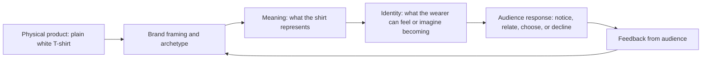

# Chapter 2: Brand Archetypes and Meaning

A plain white T-shirt is a useful starting point because it carries so little built-in information. It has a shape, a color, and a function, but those facts do not tell us what the shirt means. A brand can make the same shirt feel practical, rebellious, elegant, communal, or inventive by changing its story and presentation.

This is the practical value of **brand archetypes**. An archetype is a recognizable cultural and narrative pattern that helps an audience quickly interpret an offer. It gives a product a role in a larger story: the product might help someone explore, understand, create, belong, care, lead, or change.

The key question is:

> What does the audience get to feel, imagine, or become by choosing this brand?

Archetypes do not replace evidence. A shirt still needs to fit, last, and be worth its price. An archetype helps organize meaning around those facts so that the audience can understand why the offer matters.

## A Practical Set of Archetypes

The following set is a useful design vocabulary. The descriptions are starting points, not complete definitions:

| Archetype | Central promise | Audience may feel, imagine, or become |
| --- | --- | --- |
| Explorer | Freedom through discovery | Independent, curious, ready for the unknown |
| Sage | Understanding through knowledge | Informed, thoughtful, capable of judging well |
| Creator | Possibility through making | Imaginative, expressive, able to bring ideas into form |
| Ruler | Order and excellence | In control, accomplished, confident in standards |
| Caregiver | Support and protection | Looked after, generous, safe with others |
| Rebel | Change through resistance | Unrestricted, courageous, willing to challenge convention |
| Hero | Growth through effort | Strong, prepared, able to overcome difficulty |
| Everyperson | Belonging through common ground | Welcomed, understood, part of an ordinary community |
| Innocent | Goodness and simplicity | Hopeful, refreshed, free from unnecessary complication |
| Jester | Joy through play | Relaxed, amused, able to take a break from seriousness |
| Lover | Connection through appreciation | Attractive, attentive, close to people or sensory experience |
| Magician | Transformation through possibility | Surprised, empowered, able to see a new version of reality |

These patterns can overlap. A community workshop might combine the **Creator** and **Caregiver**: it helps people make something while also supporting beginners. A premium product might combine the **Ruler** and **Sage** by presenting high standards alongside expert explanation.

## The Same Shirt, Different Meaning

Imagine that the physical product stays constant: one plain white T-shirt with the same fabric, cut, price, and care instructions. Only the positioning changes.

### The Explorer Shirt

The shirt appears in a travel journal beside a backpack and a map. The copy says, “Pack light. Go farther.” The design emphasizes movement, adaptability, and the possibility of a day that has not been planned yet. The shirt becomes a reliable companion for someone who wants to feel ready for discovery.

This framing does not prove that the shirt is unusually durable. If durability is part of the claim, the designer needs evidence. The Explorer meaning comes from the scene, language, and invitation to imagine a life of movement.

### The Sage Shirt

The shirt appears against a clear background beside a measurement guide and a straightforward explanation of its material and care. The copy says, “A basic worth examining.” The design emphasizes clarity, comparison, and informed choice. The audience is invited to feel capable rather than dazzled.

Here, the Sage approach can make ordinary information feel valuable. It should not pretend that technical language is the same as expertise. The product details must remain accurate and understandable.

### The Rebel Shirt

The shirt appears in a stark poster that questions the pressure to display a logo. The copy says, “No label required.” The design uses direct language and challenges the assumption that clothing must announce status. The identical shirt becomes a small act of refusal.

The Rebel position can be memorable, but it should not invent an enemy or shame people who prefer other styles. A meaningful challenge gives the audience room to choose; it does not demand loyalty through insult.

### Comparing the Positions

| Position | Archetype | Message focus | Visual and verbal choices | Possible audience identity |
| --- | --- | --- | --- | --- |
| The travel companion | Explorer | Readiness for discovery | Open space, route imagery, active verbs | “I am curious and self-directed.” |
| The considered basic | Sage | Understanding and evidence | Measurements, calm layout, precise language | “I make informed choices.” |
| The unlabeled statement | Rebel | Independence from status signals | Direct typography, contrast, challenging copy | “I question unnecessary conventions.” |
| The shared uniform | Everyperson | Common ground and belonging | Group photograph, accessible language, clear price | “I am part of this ordinary community.” |
| The thoughtful gift | Caregiver | Comfort and consideration | Warm context, care instructions, practical details | “I notice what people need.” |

The shirt has not changed. The audience's interpretation has changed because the design selects a different story and a different role for the wearer.

This is a simplified model, not a guarantee. People bring their own experiences, identities, and cultural knowledge to the process. The same Rebel message may feel liberating to one person and tiring or exclusionary to another.

## Archetypes Are Not Destiny

Archetypes are models for organizing communication, not literal personality diagnoses. They do not prove that a customer, employee, or community “is” one type. A person can be adventurous at work, cautious with money, playful with friends, and caring in a family setting. A brand can also contain multiple tendencies.

Cultural context matters. Symbols, colors, stories, and ideas about leadership or independence do not mean exactly the same thing everywhere. Even within one community, people may disagree about whether a message feels welcoming, rebellious, traditional, or pretentious. Designers should test their interpretation with the actual audience instead of treating an archetype chart as universal psychology.

There are practical risks in forcing people into categories:

- **Stereotyping:** assuming that everyone in an audience wants the same identity.
- **Exclusion:** presenting one way of belonging as the only legitimate one.
- **Overpromising:** implying that buying a product will transform a person's life.
- **Inconsistency:** using a confident archetype in advertising while the product experience feels careless or confusing.
- **Cultural blindness:** borrowing a symbol without understanding its local history or meaning.

Use archetypes as questions: What role are we offering? What expectations will that role create? What evidence and behavior must support it?

## From Product to Meaning to Identity

A product does not automatically create an identity. A person may buy the Explorer-positioned shirt for a practical reason, reject the story entirely, or wear it in a way the designer never predicted. Branding offers an interpretation; the audience completes or refuses it.

For example, a campus group could present the same shirt through the Everyperson archetype as an affordable event shirt. The goal would be participation, not fashion status. The group should make clear that people may wear a shirt they already own, choose another color, or attend without purchasing anything. The archetype supports belonging only when the actual invitation is inclusive.

## Questions to Ask When Choosing an Archetype

1. What do we want the audience to feel, imagine, or become?
2. Which archetype best describes the role we can honestly support over time?
3. What product facts, service behaviors, or experiences provide evidence for that meaning?
4. What other archetypes are already present, and do they strengthen or conflict with the primary one?
5. How might different cultural groups interpret our symbols, language, and story?
6. Are we inviting an identity, or are we pressuring people to prove that they belong?
7. Who might feel excluded by this framing, and what alternatives can we provide?
8. Would the experience still make sense if the audience ignored the archetype completely?
9. What would a skeptical audience member say about our promise?

A good archetype makes a message easier to recognize without making the audience smaller than it really is.

## What You Should Remember

- Brand archetypes are reusable cultural and narrative patterns that organize meaning around an offer.
- They are not fixed personality categories, scientific diagnoses, or guarantees of behavior.
- The same plain white T-shirt can signal exploration, knowledge, rebellion, belonging, or care through different framing.
- A strong archetype connects a product promise with an identity the audience can choose, question, or refuse.
- Cultural context, evidence, consistency, and inclusion matter more than forcing every message into one label.
