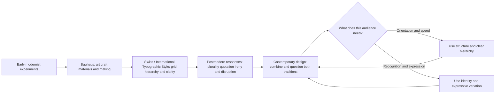

# Chapter 3: Design Language and Visual Ideas

Visual design is not decoration added after an idea. It is one of the ways an idea becomes visible. A typeface can feel official or intimate. A grid can suggest order and reliability. An unexpected scale or collision of images can suggest energy, conflict, or humor. Before we read every word, we often read these signals.

A **design language** is a recurring system of visual choices that communicates a point of view. It includes layout, typography, color, image treatment, materials, motion, and the relationship between elements. Design languages are not neutral codes with one permanent meaning. Their meanings depend on history, context, and the people interpreting them.

## A Short Historical Path

### Early Modernism

Early modernist designers responded to a changing world of industry, mass production, new technologies, and expanding cities. Many argued that design should address contemporary life rather than imitate historical decoration. Their work often explored geometric form, asymmetry, photography, new type arrangements, and the possibilities of industrial materials.

Modernism was not one single style, but several modernist movements shared an interest in making form and purpose feel connected. Designers asked what a building, poster, object, or page needed to do, and how its visual structure could support that purpose.

### Bauhaus

The Bauhaus school, founded in Germany in 1919, brought together art, craft, architecture, and design education. Its workshops investigated materials, form, color, and production. The school is often associated with experimentation and functional thinking, but it was not simply a recipe for plain rectangles. Its broader lesson was that design could be studied through making, testing, and collaboration across disciplines.

Bauhaus ideas later circulated internationally through teaching, publishing, architecture, and product design. When discussing an example, distinguish a documented connection from a general visual resemblance. A geometric composition is not automatically a Bauhaus artifact.

### Swiss / International Typographic Style

In the middle decades of the twentieth century, the Swiss or International Typographic Style developed a particularly influential approach to graphic communication. Common features included a structured grid, sans-serif typography, asymmetrical layout, clear hierarchy, photography, and careful spacing. The goal was often clarity and communication across languages and locations.

This approach made the layout feel organized without requiring every element to sit in the center. A grid could provide a hidden structure while allowing contrast, scale, and white space to guide attention. Its universal ambitions also raise a useful question: can a visual language claim to be universal when every audience has a different history and experience?

### Postmodern Responses

From the later twentieth century onward, many designers questioned modernism's confidence in restraint, universality, order, and a single correct relationship between form and function. Postmodern design often welcomed plurality, quotation, irony, historical reference, expressive typography, ornament, and deliberate disruption.

Postmodernism is not simply “messy design.” A collage, unusual typeface, or bright color does not become postmodern by itself. The important shift is often an attitude toward authority and meaning: instead of hiding the constructed nature of a message, the design may expose it, play with it, or combine incompatible references.

## The Continuing Tension

The modernist and postmodern tendencies above are useful poles, not sealed historical boxes. Contemporary websites, apps, products, and campaigns regularly combine them. A financial dashboard may use a strict grid for accuracy and a playful illustration to make a difficult task less intimidating. A fashion site may use an orderly checkout process beside a disruptive editorial layout.

| Design tension | One side emphasizes | The other side emphasizes | Contemporary example |
| --- | --- | --- | --- |
| Order and disruption | Predictability and control | Surprise and interruption | A stable app navigation with an intentionally unexpected campaign page |
| Universality and identity | Shared rules and broad legibility | Local voice and specific experience | A global service adapting language and imagery for different communities |
| Clarity and expression | Fast understanding | Mood, personality, and ambiguity | A plain product page paired with expressive launch imagery |
| Grid and anti-grid | Relationships that can be scanned | Overlap, motion, and unusual sequence | A responsive editorial site that breaks its desktop columns on purpose |
| Restraint and abundance | Focus and economy | Richness, accumulation, and sensory energy | A minimal product package versus a layered promotional installation |
| Function and irony | Form serving a practical task | Form commenting on or playfully resisting the task | A serious tool using a deliberately comic empty state |

Neither side automatically produces good design. A grid can clarify or flatten a culture. Disruption can create interest or make a service unusable. The designer's job is to understand what a choice helps the audience do and what it asks them to tolerate.

The timeline simplifies a complex history. Movements overlap, develop in different places, and include internal disagreements. Its purpose is to show an ongoing conversation rather than a straight line from “old” to “new.”

## How to Read a Design

When looking at a poster, webpage, package, building, or interface, move from observation to interpretation. Do not begin by asking whether you like it. Begin by asking what it is doing.

1. **Inventory the visible choices.** Note type size, type style, spacing, alignment, color, image treatment, materials, motion, and what is absent.
2. **Find the hierarchy.** What do you see first, second, and third? What has been made prominent, and what has been made quiet?
3. **Look for structure.** Is there a grid, a repeated pattern, a centered composition, an overlap, or a deliberate break in the expected order?
4. **Identify the implied audience.** Does the design assume expertise, speed, cultural familiarity, playfulness, or a willingness to explore?
5. **Name the tension.** Is it balancing clarity with expression, or function with irony? Which side is stronger?
6. **Test the interpretation.** What evidence in the design supports your reading? What might another audience see differently?
7. **Check the consequence.** Does the visual language help people understand, navigate, remember, participate, or decide? What does it make harder?

This process keeps analysis grounded. Saying “it feels modern” is a starting impression; explaining its grid, hierarchy, reduction, and use of sans-serif type is an argument someone else can examine.

## The White T-Shirt in Two Design Languages

Return to the same plain white T-shirt. The fabric, cut, price, and care instructions remain unchanged.

A **modernist presentation** might place the shirt in a clean grid with generous white space, a restrained sans-serif typeface, precise measurements, and a short headline such as “White T-Shirt.” The layout would make comparison easy and suggest that the product's value lies in clarity, function, and considered construction.

A **postmodern presentation** might layer a cropped photograph, oversized type, a handwritten note, and a small historical reference to the basic garment. It could use a deliberately awkward alignment or an ironic phrase such as “Nothing to see here.” The shirt might feel more self-aware, expressive, or skeptical of fashion's promises.

The product has not changed. The design language changes the expectations surrounding it. Neither presentation is automatically more truthful: both must still state material facts accurately and make the buying process understandable.

## Museum Research

Museum and institutional collections are useful because they let you examine documented objects, designers, dates, materials, and contexts rather than relying on vague online summaries. Use the search function on a credible collection site such as The Metropolitan Museum of Art, MoMA, Cooper Hewitt, the V&A, Bauhaus archives, or another institution with identifiable collection records.

Use search terms such as:

- `early modernist graphic design poster`
- `Bauhaus typography or product design`
- `Swiss International Typographic Style grid poster`
- `modernist sans serif graphic design`
- `postmodern graphic design expressive typography`
- `design object function irony`

When you find a possible example, verify the actual object yourself. Record the institution, object title, maker, date, materials, and collection description if those details are provided. Do not assume that an image appearing in a search result belongs to the institution, and do not treat a visual resemblance as proof of historical influence. Compare at least two objects and explain which design tension each one makes visible.

## What You Should Remember

- Design language carries ideas through typography, layout, images, materials, color, and interaction.
- Modernism, Bauhaus, and the Swiss / International Typographic Style developed different approaches to function, making, grid, hierarchy, and clarity.
- Postmodern responses questioned certainty and restraint by making room for plurality, quotation, irony, identity, and disruption.
- Contemporary design continues to negotiate tensions such as order versus disruption and clarity versus expression.
- The same white T-shirt can feel like a precise functional product or an ironic expressive statement when its design language changes.
- Strong analysis describes visible choices, connects them to meaning, and checks their effects on a real audience.
