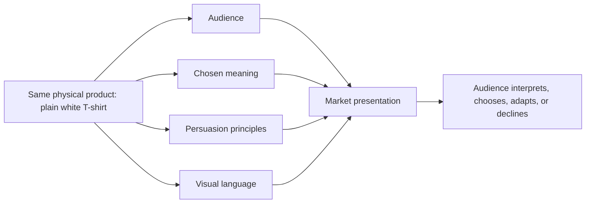

# Chapter 4: One Shirt, Four Worlds

Here is the product: an ordinary high-quality plain white T-shirt. It has the same cut, fabric, sizes, care instructions, and price in every concept that follows. We are not secretly changing the cotton, adding a magical finish, or giving the shirt a more impressive backstory.

What changes is the presentation. A product is experienced through an audience, a meaning, a persuasive approach, and a visual language. Change those ingredients and the same shirt can feel like equipment, a design object, a social invitation, or a provocation.

That is the useful trick of this case study. The shirt is stable. The interpretation is not.

## The Product Baseline

Before designing a presentation, write down what is actually true:

- **Product:** a high-quality plain white T-shirt.
- **Physical offer:** the same cut, fabric, sizes, care instructions, and price in all four concepts.
- **What is not guaranteed:** wearing the shirt does not make someone adventurous, informed, powerful, creative, or accepted by a group.
- **Design task:** make a truthful meaning available without pretending that a visual story changes the physical product.

## Concept 1: The Trail Companion

The first concept treats the shirt as a dependable part of an exploratory life.

- **Audience:** Students, travelers, and day hikers who value flexibility and want clothing that can move between ordinary plans.
- **Chosen brand archetype:** Explorer.
- **Persuasion principles:** Framing presents the shirt as adaptable; social proof can show authentic user experiences; commitment and consistency can invite someone who already values packing simply to add a versatile basic.
- **Visual-design language:** Open space, route lines, natural light, a map-like structure, and active but unhurried typography. The layout suggests movement without claiming that the shirt is technical outdoor equipment.
- **Headline:** **Pack light. Go farther.**
- **Short product story:** You do not know exactly what the day will contain. The plain shirt begins as a simple layer and leaves room for the rest of the day to change. It works for class, a long walk, or an evening with friends because it does not demand a particular costume.
- **Imagery direction:** Show the same shirt in a sequence of ordinary transitions: folded in a small bag, worn on a city walk, and paired with a jacket at dusk. Avoid implying extreme performance unless the product has evidence for it.
- **Meaning the customer is invited to buy:** Readiness, independence, and the feeling of being able to leave room for possibility.
- **Ethical concern or possible misuse:** The Explorer story can overstate durability or imply that buying the shirt creates an adventurous identity. Keep claims about performance separate from the emotional invitation, and make the actual product details easy to find.

The shirt is not sold as a heroic survival tool. It is sold as a low-drama companion for a day with more than one chapter.

## Concept 2: The Considered Basic

The second concept uses restraint to make careful evaluation feel desirable.

- **Audience:** Shoppers who compare materials, measurements, cost, and care before buying clothing.
- **Chosen brand archetype:** Sage, with a supporting Ruler tendency.
- **Persuasion principles:** Authority comes from relevant, checkable product information; commitment and consistency support a shopper's existing goal of buying fewer, more considered items; clear comparison reduces uncertainty.
- **Visual-design language:** Restrained modernist and Swiss-influenced design: a strict grid, sans-serif typography, generous white space, measured scale, precise alignment, and a clear information hierarchy.
- **Headline:** **A basic worth examining.**
- **Short product story:** The shirt does not need a dramatic identity to earn attention. Its story is the information a shopper can inspect: how it fits, how it is cared for, what it costs, and what the return policy allows.
- **Imagery direction:** Use one neutral product photograph, a flat measurement diagram, close views of construction, and a comparison panel. Keep decoration subordinate to the information.
- **Meaning the customer is invited to buy:** Confidence in making an informed, deliberate choice rather than buying because a message created excitement.
- **Ethical concern or possible misuse:** A technical appearance can create false authority. A clean grid does not prove superior quality, and dense specifications can overwhelm people. Use plain language, disclose limitations, and never substitute visual precision for evidence.

This presentation makes the shirt feel almost like a small piece of infrastructure: quiet, inspectable, and useful because it does not ask to be the center of attention.

## Concept 3: The No-Logo Statement

The third concept turns the shirt into a challenge to status signals.

- **Audience:** People who are tired of conspicuous branding and enjoy questioning familiar fashion conventions.
- **Chosen brand archetype:** Rebel.
- **Persuasion principles:** Contrast frames the plain shirt against logo-heavy alternatives; identity appeals to people who see themselves as independent; irony creates attention by making the advertisement comment on advertising.
- **Visual-design language:** Disruptive postmodern composition: abrupt scale changes, overlapping text, visible cropping, a deliberately awkward alignment, and a collision between a formal product image and a blunt phrase.
- **Headline:** **No label required.**
- **Short product story:** A white shirt can be present without announcing a ranking, affiliation, or trend. The presentation makes the absence of a logo feel intentional rather than empty.
- **Imagery direction:** Pair a straightforward image of the shirt with oversized text that interrupts the layout. Show the shirt on different people without turning any one person into the official face of independence. A small note can acknowledge that refusing one status signal does not make someone morally superior.
- **Meaning the customer is invited to buy:** Self-definition, skepticism toward status pressure, and the pleasure of declining a familiar script.
- **Ethical concern or possible misuse:** Rebel marketing can become another form of conformity or shame people for enjoying visible brands. It can also invent an enemy simply to produce outrage. Invite disagreement, avoid insults, and do not claim that a blank shirt makes its wearer more authentic than anyone else.

The joke is that a product can sell non-display with a very visible campaign. That contradiction is not a flaw if the design lets the audience notice and think about it.

## Concept 4: The Shared White

The fourth concept presents the shirt as an invitation to participate in a real activity.

- **Audience:** A campus club or neighborhood group planning an event where participants want a simple visual connection.
- **Chosen brand archetype:** Everyperson, with a supporting Caregiver tendency.
- **Persuasion principles:** Unity emphasizes a real shared activity; social proof can show actual participants; reciprocity can take the form of useful event information or an option to participate without purchasing.
- **Visual-design language:** Warm documentary photography, accessible type, a clear schedule, inclusive casting, and a flexible layout that leaves space for practical details. It should feel communal rather than like a premium fashion campaign.
- **Headline:** **Show up as you are.**
- **Short product story:** The shirt is one possible visual thread connecting people at the event. It is not a test of membership. Someone may wear a white shirt they already own, choose another color, or attend without buying anything.
- **Imagery direction:** Photograph a range of participants preparing, arriving, and doing the activity. Include the event time, location, accessibility information, cost, and alternatives with the same visibility as the shirt.
- **Meaning the customer is invited to buy:** Participation, welcome, and the feeling that there is room for them in a shared moment.
- **Ethical concern or possible misuse:** Belonging becomes manipulative when the group implies that purchasing the shirt proves loyalty or is required for friendship. Make participation genuinely possible without a purchase and do not use an image of community to hide an exclusionary rule.

Here the shirt's most important feature is not its whiteness. It is the way the invitation makes room for people who may not own it.

## Synthesis Table

| Concept | Audience | Archetype | Persuasion emphasis | Visual language | Meaning offered |
| --- | --- | --- | --- | --- | --- |
| The Trail Companion | Explorers and flexible dressers | Explorer | Framing, social proof, consistency | Open, route-inspired, active | Readiness and independence |
| The Considered Basic | Careful product evaluators | Sage / Ruler | Authority, clarity, comparison | Restrained modernist / Swiss-influenced grid | Informed choice and standards |
| The No-Logo Statement | People questioning status signals | Rebel | Contrast, identity, irony | Disruptive postmodern collage | Self-definition and refusal |
| The Shared White | A real club or neighborhood audience | Everyperson / Caregiver | Unity, social proof, reciprocity | Warm, documentary, accessible | Participation and welcome |

The table is not a formula for predicting behavior. It is a way to see which decisions change the meaning around an unchanged object. A person could encounter all four presentations and choose none of them, or choose one for a reason the designer never anticipated.

The diagram shows synthesis, not a guaranteed path. A market presentation is assembled from several choices, and the audience still has the final interpretive power.

## What This Case Study Teaches

The most important design decision is not choosing a clever headline. It is deciding what relationship the presentation offers between the product and the audience.

- The Explorer says, “This can accompany the life you want to discover.”
- The Sage says, “You can judge this offer with care.”
- The Rebel says, “You can question the signals other people expect.”
- The Everyperson says, “You can participate without having to perform perfection.”

None of these meanings is physically stored inside the shirt. They are built through selection, emphasis, context, and repetition. That is why designers need both creative range and ethical discipline. The more powerfully a presentation shapes interpretation, the more carefully it should distinguish an invitation from a false promise.

## What You Should Remember

- One unchanged product can receive radically different meanings through audience, archetype, persuasion, and visual language.
- The four concepts use Explorer, Sage, Rebel, and Everyperson positions without claiming that the shirt transforms the wearer.
- A restrained modernist presentation can make the shirt feel precise and inspectable; a postmodern presentation can make it feel ironic and oppositional.
- Ethical design keeps emotional meaning separate from unsupported product claims and leaves people room to decline.
- The real synthesis is not product plus decoration. It is a truthful offer made legible to a particular audience.
