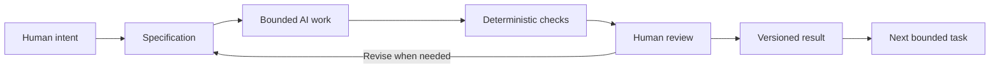

# Chapter 5: From Meaning to Method

The first four chapters used a plain white T-shirt to show how much meaning can gather around an ordinary object. Persuasion shapes attention, trust, and action. Brand archetypes suggest what an audience might feel, imagine, or become. Design language makes that meaning visible through form, structure, typography, imagery, and interaction.

Together, these three lenses form a practical control framework for creative work:

- **Persuasion asks:** What response are we trying to enable?
- **Archetype asks:** What meaning or identity are we expressing?
- **Design language asks:** How should that meaning look and feel?

The framework is useful when a person is working with an AI system because it turns a vague wish such as “make this compelling” into decisions that can be discussed, tested, and revised.

## Three Lenses, One Direction

Suppose a designer wants an AI assistant to help create a campaign for the same white T-shirt.

**Persuasion** clarifies the intended response. Is the audience supposed to compare details, sign up for an event, consider a purchase, or simply notice a new idea? A request that names the desired response gives the work a purpose without guaranteeing that anyone must comply.

**Archetype** clarifies the meaning. Is the shirt being framed as an Explorer's companion, a Sage's considered basic, a Rebel's refusal of status signals, or an Everyperson's invitation to participate? This choice affects the story and the identity being offered.

**Design language** clarifies the expression. Should the result use a restrained grid and precise hierarchy, or an energetic collage with expressive type? The visual language should make the intended meaning easier to recognize, not merely make the output look impressive.

| Lens | Controlling question | Example for the white T-shirt |
| --- | --- | --- |
| Persuasion | What response are we trying to enable? | Help a shopper compare fit and care details |
| Archetype | What meaning or identity are we expressing? | A Sage-like identity of careful judgment |
| Design language | How should that meaning look and feel? | Restrained grid, clear labels, measured spacing |

The lenses are connected but not interchangeable. A dramatic layout is not a persuasive strategy by itself. A Rebel archetype is not proof that a product is original. A call to action is not an ethical goal unless the audience can understand and freely decline it.

## Why Specifications Matter

An AI task should be **bounded by a specification**: a clear statement of purpose, audience, required content, constraints, and acceptance criteria. The specification is not a cage for creativity. It is the frame that makes creativity reviewable.

A useful specification might say:

- Create one Markdown chapter for first-year students.
- Explain the three lenses in plain language.
- Use the white T-shirt as a recurring example.
- Include one comparison table and one valid Mermaid diagram.
- Do not invent sources, quotations, or URLs.
- Finish with named sections that a checker can find.

These details prevent predictable drift. Without a bounded task, an AI system may produce a polished introduction while omitting the table, change the product halfway through, invent a citation, or answer a different question. A specification makes omissions visible and gives the human editor something concrete to evaluate.

## Why Git Matters

Git provides **traceability and recovery**. A commit records a version of the work and the reason it changed. Branches let a student work on one issue without confusing it with another. A diff makes it possible to review what was added, removed, or altered. If an AI-assisted edit takes an unhelpful direction, an earlier version remains available for comparison or recovery.

Version control does not decide whether writing is true or meaningful. It preserves evidence of decisions so that people can inspect those decisions. That is especially important when a project involves several bounded tasks and more than one revision.

## Deterministic Checks and Probabilistic Review

A **deterministic check** gives the same result whenever the same input meets the same condition. A script can check that required files exist, headings appear, a Mermaid fence is present, or a document contains no accidental blank file. These checks are fast, cheap, and repeatable. They are excellent for catching mechanical omissions.

They are not a substitute for reading. A chapter can contain every required heading and still be confusing, inaccurate, repetitive, or ethically weak.

AI review is useful for a different reason. An AI system can suggest unclear passages, identify possible omissions, compare a draft with a specification, or offer alternative explanations. But its review is **probabilistic**: it can miss a problem, misunderstand context, or sound confident while making a poor judgment. Its output is evidence to consider, not a final verdict.

A strong workflow uses both kinds of checking:

| Check | Good at finding | Still needs human attention |
| --- | --- | --- |
| Deterministic script | Missing files, headings, fences, or simple format failures | Meaning, accuracy, tone, and usefulness |
| AI review | Possible ambiguity, repetition, gaps, or alternative readings | Whether the suggestion is correct and appropriate |
| Human review | Context, truthfulness, ethics, intent, and final quality | Time and deliberate attention |

## The Pit-Stop Moment

Imagine a race car moving through a long course. Automation can keep running around the track: generating drafts, checking file names, counting sections, and reporting simple failures. But a selected moment deserves a pit stop. The car slows down so a team can inspect what matters before it returns to the course.

Human review is that pit stop. The human checks whether the work still serves the original intent, whether the meaning is honest, whether the language fits the audience, and whether the result creates an unintended risk. The inspection should be deliberate rather than ceremonial. “The script passed” is not the same as “the chapter is ready.”

The metaphor also suggests proportion. Not every small wording change requires a full project meeting, but a claim about health, money, identity, safety, or another person's dignity deserves more careful inspection than a harmless formatting change.

The diagram describes a loop, not a one-way conveyor belt. Human review can send the work back to the specification when the task itself was unclear or incomplete.

## A Reusable Workflow

For future creative or technical tasks, use this sequence:

1. **Name the intent.** Decide what response, meaning, and experience the work should support.
2. **Write the specification.** State the audience, scope, constraints, required outputs, and acceptance criteria.
3. **Bound the AI task.** Ask for one understandable unit of work, such as one chapter or one component.
4. **Run cheap checks.** Use deterministic validation for file presence, structure, syntax, and other mechanical requirements.
5. **Hold the pit stop.** Read the result as a human. Check context, truthfulness, inclusion, tone, and whether the meaning matches the intent.
6. **Record the result.** Use Git to review the diff, preserve the version, and make the next change traceable.

This process keeps responsibility visible. AI can accelerate drafting and comparison, but acceleration does not transfer judgment away from the person directing the work.

## Questions for Next Week

1. Which of the three lenses is easiest for you to use, and which one do you tend to overlook?
2. What is one task in your own work that would become clearer if you wrote acceptance criteria first?
3. Which parts of a project could a deterministic check validate cheaply?
4. What kind of decision would require a serious human pit stop even if every automated check passed?
5. When has a polished presentation made an offer seem more trustworthy than the evidence justified?
6. How could Git help you explain not only what changed, but why it changed?
7. What should an AI assistant never be allowed to decide on your behalf?

## What You Should Remember

- Persuasion, archetype, and design language answer different questions that work best together.
- A specification bounds AI-assisted work so that purpose, scope, constraints, and success can be reviewed.
- Git preserves traceability and recovery; deterministic checks catch cheap mechanical failures.
- AI review can be useful, but it is probabilistic and must be evaluated rather than obeyed.
- Human beings remain responsible for judgment, meaning, truthfulness, context, ethics, and final decisions.
- The best workflow keeps automation moving while making room for deliberate human pit stops.
